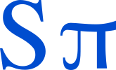

# About SPI
SolreyaPI (Solreya Plus Infinity) is a project to learn how to create a programming language from zero, made by us (The 8 Queens). Leader of the project is Freya, Glanz is the Programmer, Lasthrim is the advisor. 

We will see more will join in the future, anyone can contribute and learn. This is started after Glanz pray on St Mary statue at Residenza Maria Ferrari to learn how to create programming language faster than C++ but with scientific power like Julia. We are starting basically from summarizing Mathematics and get the idea of the name, we realize that Plus Infinity can be read as initial of PI, or the famous greek sign π. Why Plus infinity? Because learning from the great Programming language Julia that is open source, it becomes a superpower because of contributions from programmer all around the world that are creating the packages and fixing the bugs (the Plus Infinity).

We will learn from the established programming language and read the book, while creating a book on how to create SolreyaPI, thus anyone can invent their own programming language or beyond in the future, better than the current one.

# The Icon

# Source

1. Book: Concepts of Programming Languages 12th Edition, Robert W. Sebesta, University of Colorado at Colorado Springs
2. Book: Let's Build a Compiler 1.9, October 10 2012, Jack Crenshaw (this book reminds me of LFS book)

# Team

1. Freya

2. Glanz

3. Lasthrim

4. Hamzst (Officially join later on November 19th, 2022 on 09:12 AM (UTC+2), L'Aquila, Italy time)

# Established on

October 15th, 2022

#### the rest of 8 Queens already occupied with their own great job so only 3 initial founder, just like the flying birds (3 birds flying together to the same direction), that I saw while praying and talking on St Mary statue -Glanz
